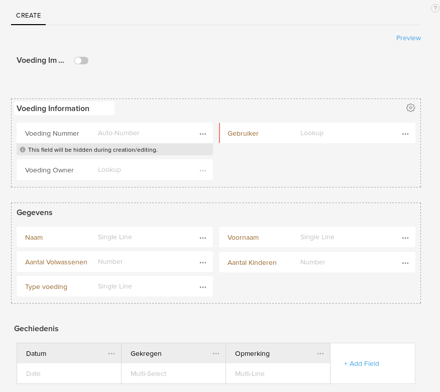

Module Setup
============

## Standard template
The template contains 3 blocks:
1) General Information
2) User Details (Gegevens)
3) History (Gechiedenis)


### General Information
This block contains the following fields:
* Number (unique ID, generated by the system)
* Owner (CRM requirement)
* User: Linked to Accounts 

### User Details
This block is here for information purposes only, it allows a quick overview of the user record, this info is added using scripts in the workflows as embedding it from the linked user was not possible in the system.

It contains the following fields:
* Name: Single line field
* First Name: Single line field
* Number of children: Number field
* Number of adults: Number field
* Type of food (gegeterian, halal, etc.): Single line field

### History
This block is a subform.
Each entry contains:
* Date: Date field
* Received: Multi-select field, used to keep extras
* Remarks: Multi-line field

## Buttons
### Received today
This is a button to quickly add the default package to the history.  
This is a button on the view page that contains a function `addToday`. This function received the ID of the entry as `foodID`.
```deluge
entry = zoho.crm.getRecordById("Food",foodID.toNumber());

defaultReceived = list();
defaultReceived.add("Food");

todayFood = Map();
todayFood.put("Date",today);
todayFood.put("Received",defaultReceived);

subform = entry.get("Subform_1"); // may be different name
subform.add(todayFood);
zoho.crm.updateRecord("Food", foodID.toNumber(), entry);

return "OK!"; //message given to user
```
