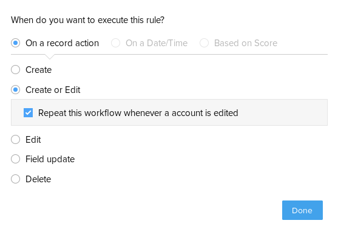
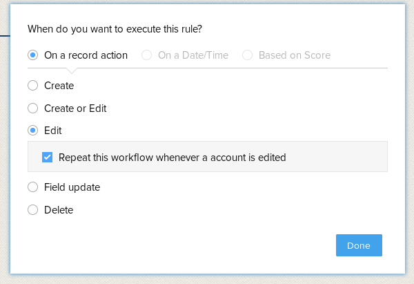

Workflow Rules to sync data
===========================

## New food
This is a rule to add a new Food record whenever a new Account gets added.

### When condition
The when condition is set on create or edit, while theoreticaly edit is not needed we keep this as a safe guard for any issues.


### Condition 1
We apply the rule to all accounts
This runs a function called `newFood` which receives an Account ID as `accountID`.
```deluge
user = zoho.crm.getRecordById("Accounts",accountID);
records = zoho.crm.getRecords("Food");

// Check if exists to prevent duplicates
exists = false;
for each record in records
{
	userID = record.get("User").get("id");
	if(userID.toString() == accountID.toString())
	{
		exists = true;
	}
}

if (!exists)
{
	mp = Map();

	userMP = Map();
	userMP.put("id",accountID);

    // This copies the personal info fields
    // You need to add a line for every field
	mp.put("Name",gebruiker.get("Name")); 

	mp.put("Gebruiker",userMP);

	created = zoho.crm.createRecord("Food",mp);
	info mp; // handy debug lines
	info created;
}
```

## Update food
This workflow is used to update the personal info inside the food records, it is a hack to not being able to embed blocks of an account inside a module.

### When condition
The when condition is set on edit.


### Condition 1
We apply the rule to all accounts
This runs a function called `updateFood`. This function currently updates all info. This could change in the future.
```deluge
records = zoho.crm.getRecords("Food");
for each  record in records
{
	userIF = record.get("User").get("id");
	user = zoho.crm.getRecordById("Accounts",userID);

    // This copies the personal info fields
    // You need to add a line for every field
	record.put("Name",user.get("Name"));

	zoho.crm.updateRecord("Food",record.get("id"),record);
}
```
